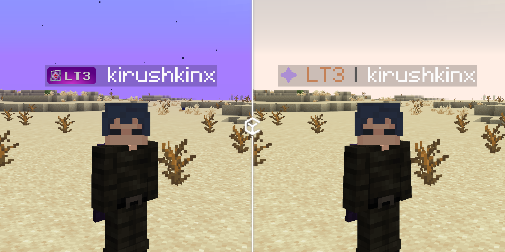
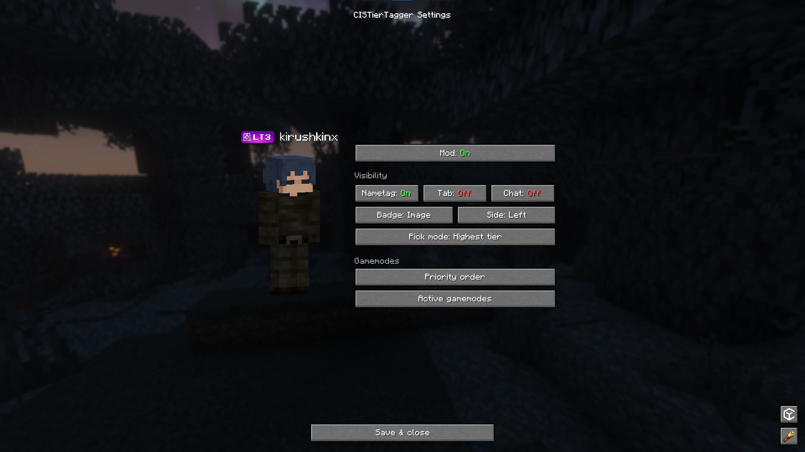
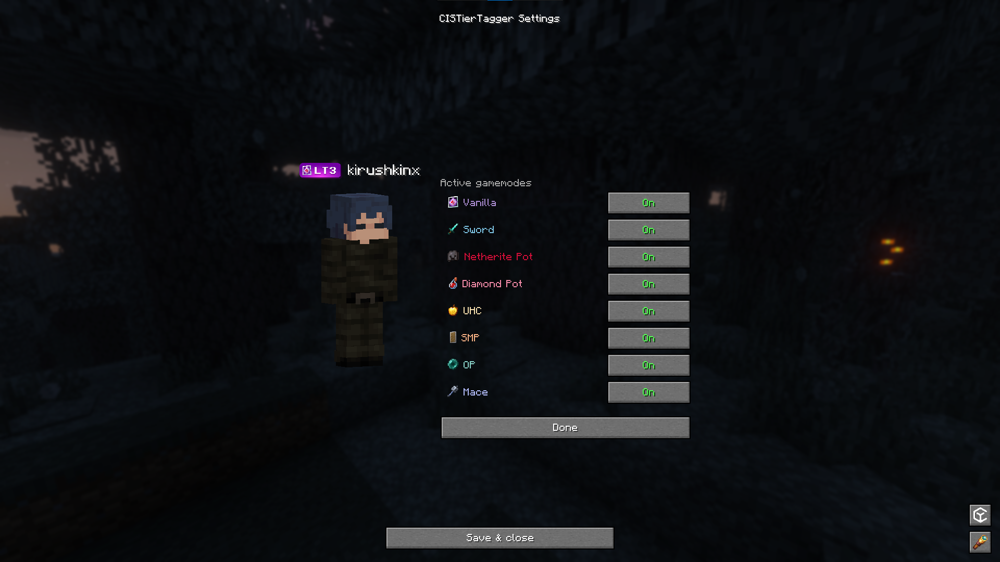
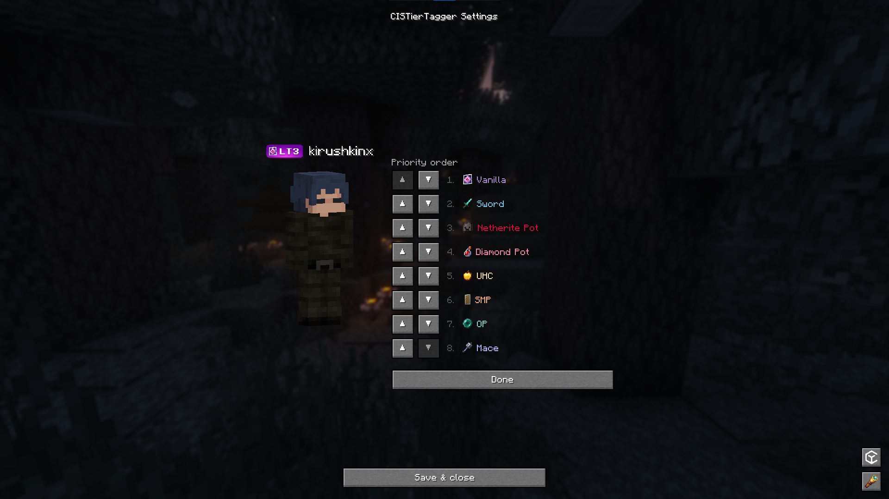
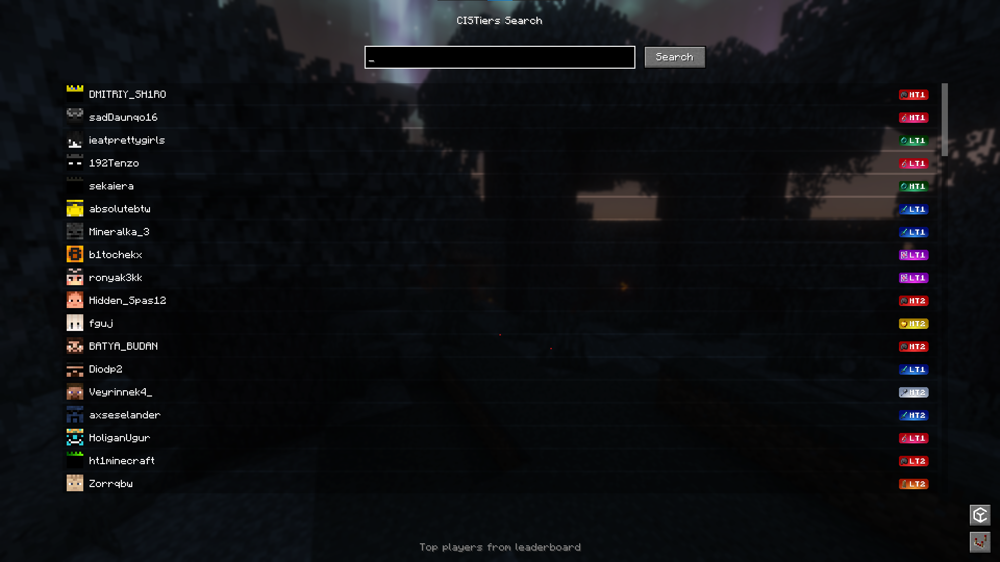
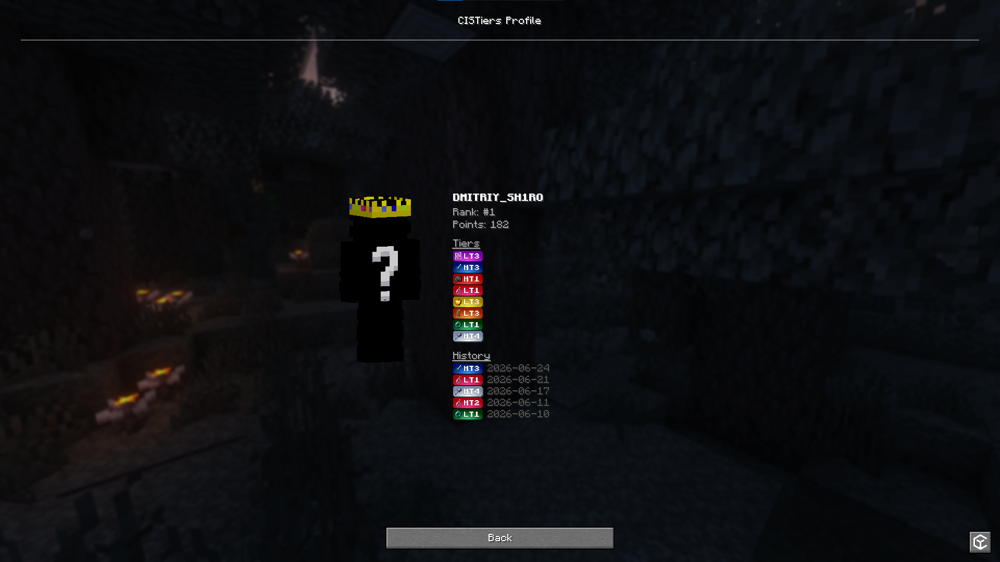

[English](readme.md) | Русский

## CISTierTagger
Официальный мод отображения тиров для [CISTiers](https://cistiers.com)

### О модификации
CISTierTagger - мод для отображения тира игрока в разных режимах игры на основе рейтинга [cistiers.com](https://cistiers.com) прямо в игре.

### Конфигурация
Отображение можно настроить, открыв конфигурацию мода через `ModMenu` или командой `/cistier`.

  
  

### Лидерборд и профили
Мод также позволяет искать игроков в рейтинге через поле поиска в меню `/cistier` или открытием профиля конкретного игрока командой `/cistier <ник>`.

  
  

### Возможности

- Бейдж тира в неймтеге, таб-листе и чате - каждый переключается независимо.
- Отображаемый тир выбирается по порядку приоритета или по самому высокому тиру игрока среди всех режимов.
- Переключатели для каждого режима из рейтинга [cistiers.com](https://cistiers.com).
- Экран поиска с превью - `/cistier <ник>` открывает полный профиль (ранг, очки, тиры, история).
- Серверы могут скрыть бейджи через plugin message - см. [restriction.md](docs/restriction_ru.md).

### Лицензия
Проект распространяется под лицензией [GPL-3.0](license).
